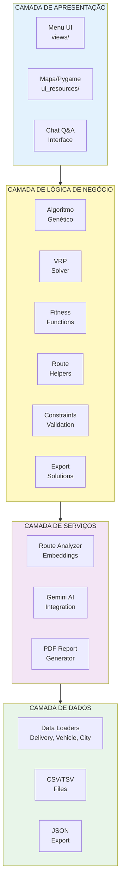
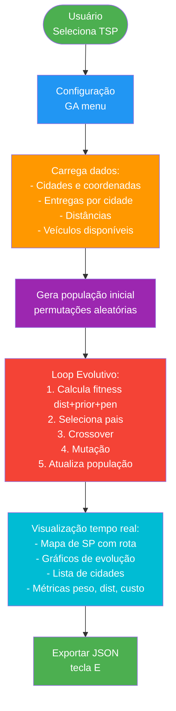
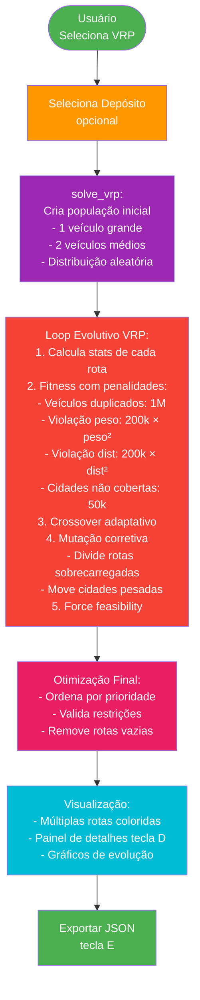
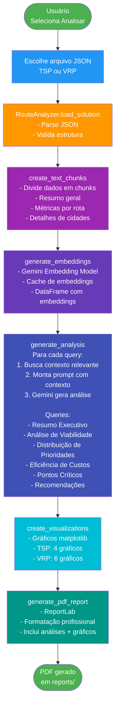

# Arquitetura do Sistema de Otimização de Rotas

## Visão Geral

Sistema de otimização de rotas para distribuição de medicamentos usando Algoritmos Genéticos, com suporte a TSP (Traveling Salesman Problem) e VRP (Vehicle Routing Problem), incluindo visualização em tempo real e análise com IA (Google Gemini).

---

## Arquitetura de Alto Nível



---

## Estrutura de Diretórios

```
fiap_tsp/
│
├── main.py                      # Ponto de entrada principal
│
├── config/                      # Configurações globais
│   ├── __init__.py
│   ├── ga_config.py            # Config Algoritmo Genético
│   ├── ui_layout.py            # Layout da interface
│   └── ui_theme.py             # Tema visual
│
├── views/                       # Camada de apresentação
│   ├── __init__.py
│   ├── menu_inicial.py         # Menu principal
│   ├── mode_selection.py       # Seleção TSP/VRP
│   ├── ga_menu.py              # Configuração GA
│   ├── tsp_view.py             # Execução TSP
│   ├── vrp_view.py             # Execução VRP
│   ├── vrp_depot_selection.py  # Seleção de depósito
│   ├── analyze_view.py         # Análise e chat
│   └── open_report_view.py     # Abertura de relatórios
│
├── genetic_algorithm.py         # Core do AG
├── vrp_solver.py               # Solver VRP
├── route_helpers.py            # Funções auxiliares
│
├── ui_resources/               # Recursos de UI
│   ├── ui_renderer.py          # Renderização principal
│   ├── draw_functions.py       # Funções de desenho
│   └── vrp_details_renderer.py # Detalhes VRP
│
├── loader_resources/           # Carregadores de dados
│   ├── data_loader.py          # Loader principal
│   ├── delivery_loader.py      # Entregas
│   ├── vehicle_loader.py       # Veículos
│   └── city_loader.py          # Cidades
│
├── infra/                      # Infraestrutura
│   ├── __init.py
│   └── solution_exporter.py    # Export JSON
│
├── route_analyzer.py           # Análise com IA
├── sp_map.py                   # Renderização mapa
│
├── data_files/                 # Dados do problema
│   ├── deliveries.csv          # Entregas
│   ├── veiculos.csv            # Veículos
│   ├── cidades_sp.tsv          # Distâncias
│   ├── worldcities.csv         # Coordenadas
│   └── geojs-35-mun.json       # GeoJSON SP
│
├── solutions/                  # Soluções exportadas
├── reports/                    # Relatórios PDF
│
├── tests/                      # Testes automatizados
│   ├── conftest.py
│   ├── test_loaders.py
│   ├── test_genetic_algorithm.py
│   ├── test_constraints.py
│   ├── test_export.py
│   └── test_vrp_solver.py
│
└── docs/                       # Documentação
    ├── ARQUITETURA.md          # Este arquivo
    ├── TESTING.md              # Doc testes
    └── FLUXOS.md               # Fluxogramas
```

---

## Componentes Principais

### 1. Main (main.py)
**Responsabilidade**: Orquestração do fluxo principal

```python
main()
  ├── load_all_data()
  ├── show_analyze_menu()
  │   ├── run_analyze_flow()
  │   ├── run_open_report_flow()
  │   └── run_solver_flow()
  │       ├── show_mode_selection()
  │       ├── show_ga_menu()
  │       ├── run_tsp_mode() / run_vrp_mode()
  │       └── export_solution_to_json()
  └── sys.exit()
```

### 2. Genetic Algorithm (genetic_algorithm.py)
**Responsabilidade**: Implementação dos operadores genéticos

**Funções principais**:
- `generate_random_population()` - Gera população inicial
- `calculate_fitness()` - Avalia qualidade da solução
- `crossover_ox/pmx/cx()` - Operadores de cruzamento
- `mutate_swap/inversion/scramble()` - Operadores de mutação
- `selection_tournament/roulette/rank()` - Seleção de pais

**Fluxo do AG**:
```
1. Gerar população inicial
2. Avaliar fitness de todos
3. Loop (até convergência):
   a. Selecionar pais (tournament/roulette/rank)
   b. Cruzamento (OX/PMX/CX)
   c. Mutação (swap/inversion/scramble)
   d. Avaliar fitness
   e. Substituir população (elitismo)
4. Retornar melhor solução
```

### 3. VRP Solver (vrp_solver.py)
**Responsabilidade**: Resolver problema de roteamento de veículos

**Classes**:
- `VRPRoute` - Representa uma rota individual
- `VRPOptions` - Configurações e pesos de penalidades

**Funções**:
- `solve_vrp()` - Solver principal
- `calculate_vrp_fitness()` - Fitness com penalidades fortes
- `adaptive_crossover()` - Crossover para VRP
- `feasibility_mutation()` - Mutação corretiva
- `force_feasibility()` - Força viabilidade das rotas

### 4. Route Analyzer (route_analyzer.py)
**Responsabilidade**: Análise de soluções com IA

**Classe principal**: `RouteAnalyzer`

**Métodos**:
- `load_solution()` - Carrega JSON
- `create_text_chunks()` - Prepara dados para embeddings
- `generate_embeddings()` - Gera embeddings com Gemini
- `find_relevant_context()` - Busca semântica
- `generate_analysis()` - Gera 6 análises especializadas
- `create_visualizations()` - Gráficos matplotlib
- `generate_pdf_report()` - PDF com ReportLab

### 5. Data Loaders (loader_resources/)
**Responsabilidade**: Carregamento e validação de dados

**Estruturas de dados**:
```python
@dataclass
class Delivery:
    id: int
    medicine_name: str
    quantity: int
    total_weight: float
    city: str
    location_name: str
    priority: int  # 0=alta, 1=média, 2=baixa

@dataclass
class Vehicle:
    vehicle_id: str
    max_load: float
    max_distance: float
    type: str
    max_weight: float
    cost_per_km: float
    name: str
```

---

## Fluxo de Dados

### Modo TSP



### Modo VRP



### Análise com IA



---

## Padrões de Projeto Utilizados

### 1. **Strategy Pattern** (Operadores GA)
```python
# Diferentes estratégias de mutação
mutations = {
    'swap': mutate_swap,
    'inversion': mutate_inversion,
    'scramble': mutate_scramble
}

# Diferentes estratégias de seleção
selections = {
    'tournament': selection_tournament,
    'roulette': selection_roulette,
    'rank': selection_rank
}
```

### 2. **Factory Pattern** (Data Loaders)
```python
def load_all_data():
    """Factory que cria todas as estruturas de dados"""
    deliveries = load_deliveries()
    vehicles = load_vehicles()
    cities, distances = load_cities_and_distances()
    # ... retorna tudo estruturado
```

### 3. **Observer Pattern** (UI Updates)
```python
# Callbacks para atualizar interface durante processamento
def update_status(msg: str):
    current_status = msg
    render_status_screen(screen, current_status)
```

### 4. **Template Method** (Solver)
```python
class VRPSolver:
    def solve():
        initialize_population()
        for generation in range(max_gen):
            evaluate()
            select()
            crossover()
            mutate()
            replace()
        return best_solution
```

---

## Decisões Arquiteturais

### 1. **Separação de Concerns**
- **Views**: Apenas apresentação
- **Logic**: Algoritmos e regras de negócio
- **Data**: Carregamento e persistência
- **Services**: Serviços externos (IA, PDF)

### 2. **Pygame para Visualização**
- Escolhido por: performance, controle total, cross-platform
- Alternativas consideradas: Tkinter, PyQt (mais complexas)

### 3. **Google Gemini para IA**
- Escolhido por: embeddings + geração, API simples, gratuito
- Alternativas: OpenAI (pago), modelos locais (mais pesados)

### 4. **JSON para Export**
- Estrutura clara, fácil de parsear, legível
- Preparado para consumo por LLMs
- Inclui metadados e instruções

### 5. **Penalidades Fortes no VRP**
- Preferência por soluções viáveis
- Penalidades exponenciais (peso², dist²)
- Force feasibility como fallback

---

## Métricas e Performance

### Tempo de Execução Típico
- **TSP** (15 cidades): 30-60 segundos
- **VRP** (15 cidades, 3 veículos): 1-3 minutos
- **Análise IA**: 20-30 segundos

### Parâmetros Padrão
```python
POPULATION_SIZE = 100
MUTATION_RATE = 0.4
PRIORITY_WEIGHT = 20
VRP_GENERATIONS_PER_ROUTE = 100
```

### Escalabilidade
- **Limite prático TSP**: ~20 cidades
- **Limite prático VRP**: ~30 cidades, ~10 veículos
- **Gargalo**: Cálculo de fitness (O(n²))

---

## Segurança e Validação

### Validações Implementadas
1. **Dados de entrada**: CSV bem formados, tipos corretos
2. **Restrições**: Peso ≤ capacidade, distância ≤ autonomia
3. **Prioridades**: Apenas 0, 1, 2
4. **Veículos únicos**: Cada veículo usado no máximo 1x
5. **Cobertura**: Todas cidades visitadas

### Tratamento de Erros
- Try-catch em I/O (CSV, JSON)
- Validação de API key Gemini
- Fallback para valores padrão
- Mensagens de erro claras

---

## Extensibilidade

### Como Adicionar...

**Novo operador de mutação**:
```python
# genetic_algorithm.py
def mutate_new_operator(individual, probability):
    # implementação
    return mutated

# config/ga_config.py
'new_op': mutate_new_operator
```

**Nova métrica no fitness**:
```python
# genetic_algorithm.py
def calculate_fitness(...):
    fitness = distance + priority_penalty + NEW_METRIC
    return fitness
```

**Novo tipo de veículo**:
```python
# data_files/veiculos.csv
V4,Drone,drone,50,100,50,5.0
```

---

## Dependências Externas

### Python (>=3.8)
- `pygame` - Interface gráfica
- `matplotlib` - Gráficos
- `numpy` - Operações matemáticas
- `pandas` - Manipulação de dados
- `google-generativeai` - IA
- `reportlab` - PDF

### Dados
- CSV/TSV de São Paulo (IBGE, fontes públicas)
- GeoJSON de municípios paulistas

---

**Versão**: 1.0  
**Última atualização**: 2026-01-14  
**Autores**: Equipe Tech Challenge - Fase 2
