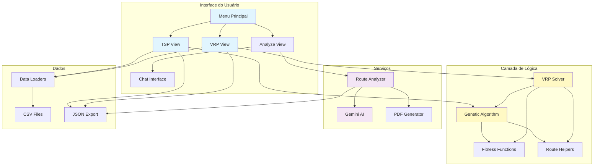
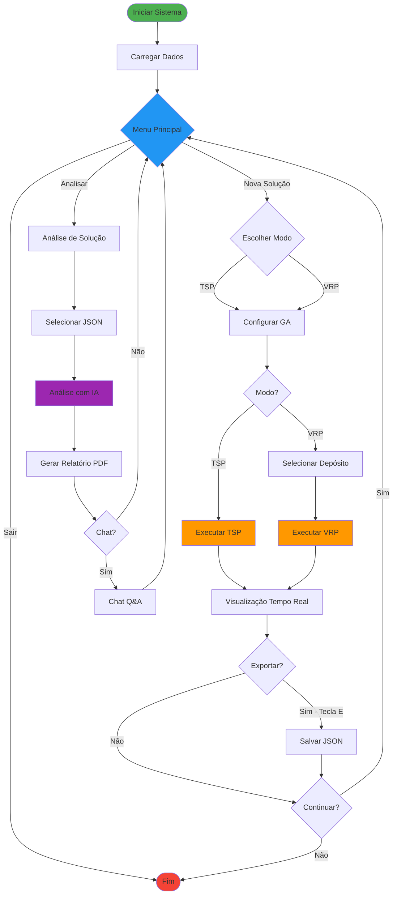
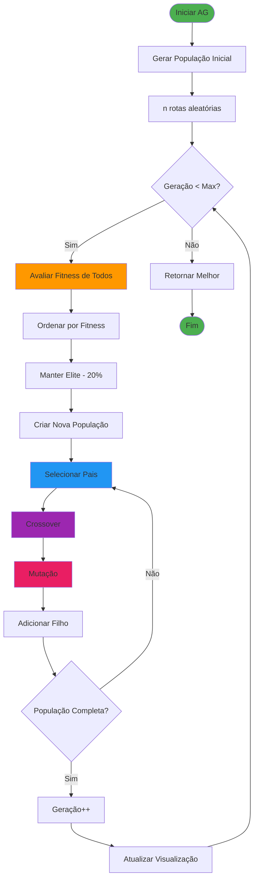
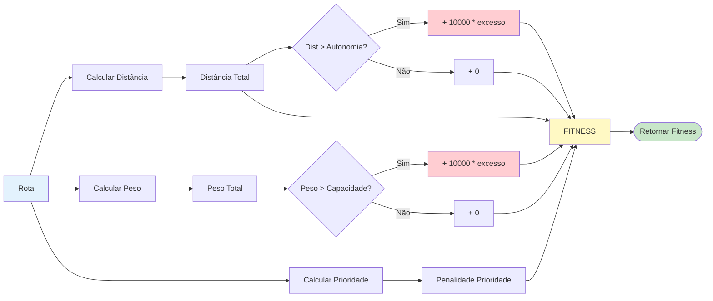
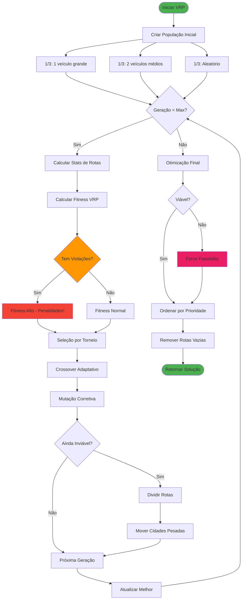
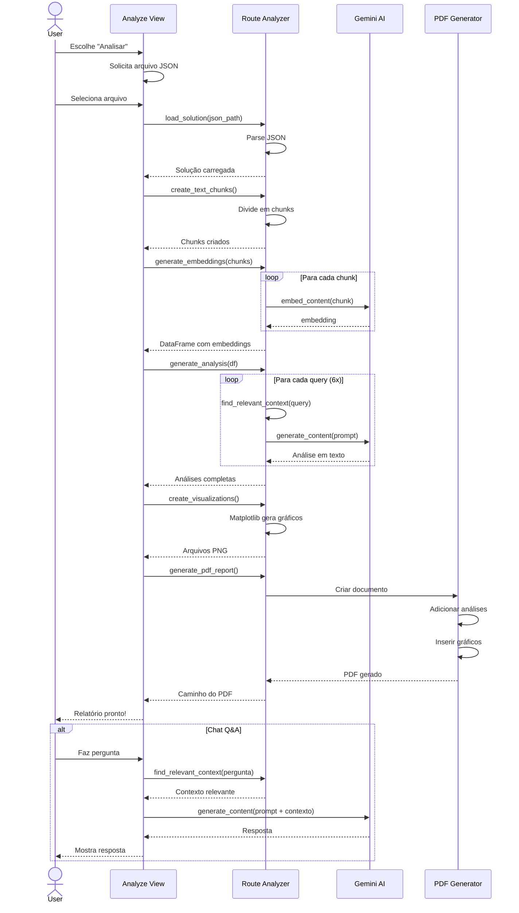
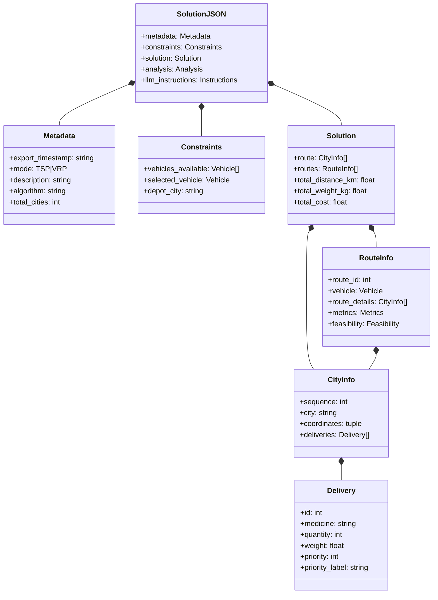
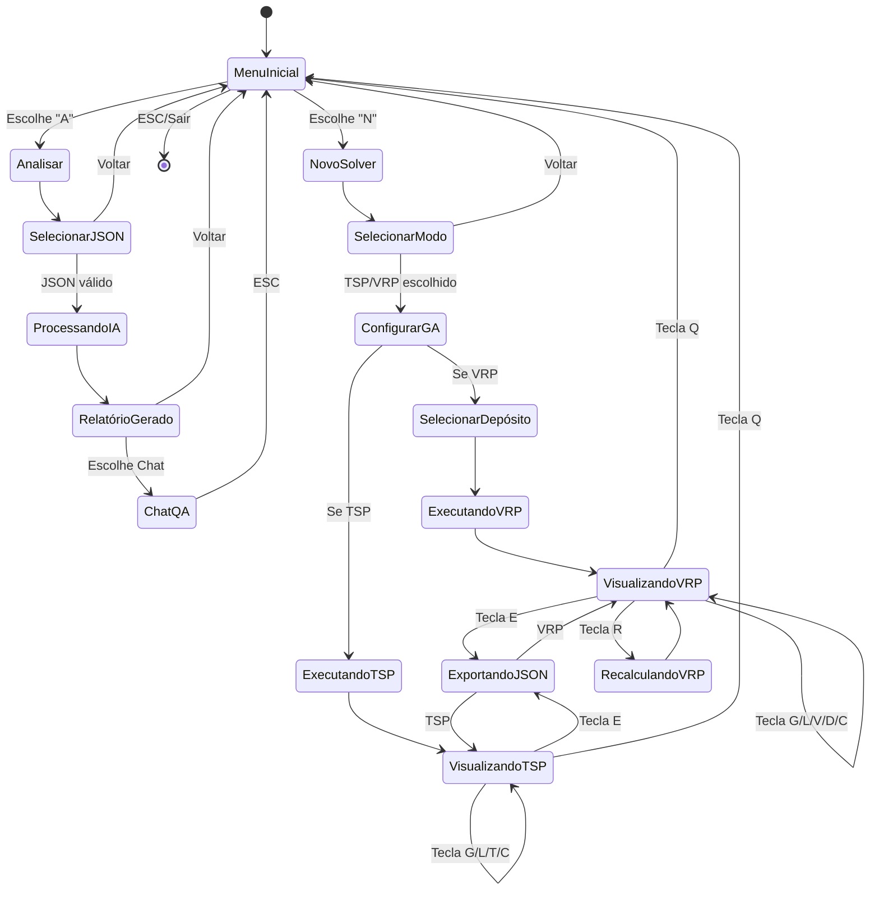
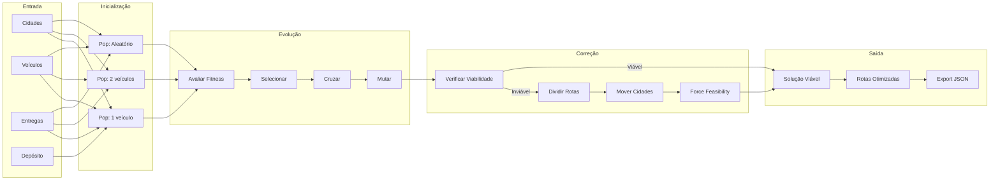
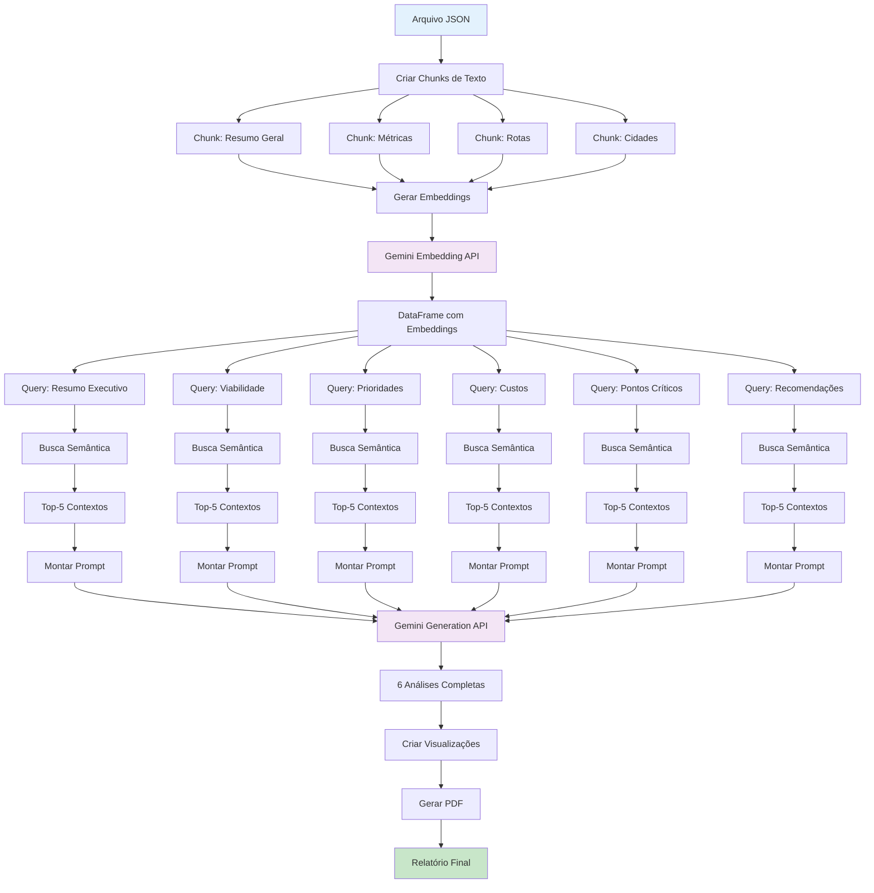

# Diagramas do Sistema

Este documento contém todos os diagramas do sistema de otimização de rotas em formato Mermaid (visualizável no GitHub).

---

## 1. Diagrama de Componentes

---

## 2. Fluxo Principal do Sistema

---

## 3. Fluxo do Algoritmo Genético (TSP)

---

## 4. Função Fitness

---

## 5. Fluxo VRP Solver

---

## 6. Diagrama de Sequência - Análise com IA

---

## 7. Estrutura de Dados - JSON Export

---

## 8. Diagrama de Estados - Interface

---

## 9. Pipeline de Otimização VRP

---

## 10. Interação com Gemini AI

---

**Versão**: 1.0  
**Última atualização**: 2026-01-14
